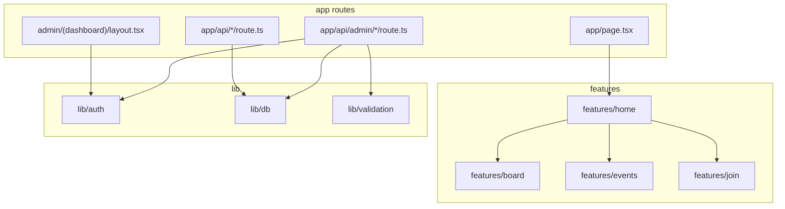

# Codebase architecture restructure

## Why it feels unready

- [`app/page.tsx`](app/page.tsx) is a ~750-line client file: copy, nav, fetch, and every homepage section live together. Adding a section means editing that file.
- [`components/`](components/) is a flat mix of shadcn primitives, 3D mascot, marketing UI, and admin forms.
- [`lib/db.ts`](lib/db.ts) holds three domains (applications, board, events). Adding “projects” or “sponsors” means growing one file.
- Admin auth is copy-pasted on every `/admin/**` page and `/api/admin/**` route ([`CLAUDE.md`](CLAUDE.md) already calls this out). A new CMS type is easy to ship **unprotected**.

Keep **Next App Router, Cloudflare/OpenNext, `@/*` → repo root**. Do **not** introduce `src/` — `wrangler.jsonc`, `workers/cloudinary-sign/`, and `db/` already live at root.

Stay away from barrel `index.ts` re-exports (they hide import cost and confuse bundling). Import the concrete file.

## Target tree

```
app/                          # routes only — thin pages
  layout.tsx
  page.tsx                    # composes <HomePage />
  admin/
    login/page.tsx
    (dashboard)/              # URL unchanged; auth lives in layout
      layout.tsx
      page.tsx
      board/  events/
  api/                        # unchanged URL map

features/
  home/                       # marketing page
    home-page.tsx             # client shell: nav, scroll, mascot slots, fetch
    content.ts                # NAV_ITEMS, STATS, PILLARS, BENEFITS
    sections/                 # hero, about, journey, board, events, benefits, join, footer
  board/                      # public cards + types used by home + admin
  events/
  join/                       # join-form, join-squares
  admin/                      # admin-nav, forms, delete-button, image-upload

components/
  ui/                         # button, card, badge (shadcn)
  mascot/                     # 3d, toggle, glow, easter-egg, marquee
  motion/                     # scroll-stack, particle-text, enhanced-button, …
  theme/                      # provider, toggle

lib/
  db/
    client.ts                 # getDb()
    applications.ts
    board-members.ts
    events.ts
  auth/
    session.ts                # cookie HMAC (today’s lib/session.ts)
    require-admin.ts          # page redirect + API 401
  validation/
    application.ts
    board-member.ts
    event.ts
  use-mounted.ts
  utils.ts
```

`workers/`, `db/schema.sql`, OpenNext/Wrangler configs stay put.



## Seams to add (this is the “prod ready” part)

**1. Homepage is a composer, not a dump.** [`app/page.tsx`](app/page.tsx) becomes:

```tsx
import { HomePage } from "@/features/home/home-page"
export default function Page() {
  return <HomePage />
}
```

`home-page.tsx` keeps the existing client behavior (mount gate, mascot refs, scroll spy, client fetch). Each `id="hero"|about|journey|board|events|benefits|join` block moves to `features/home/sections/<name>.tsx`. Shared copy goes to `features/home/content.ts`. Duplicate `BoardMemberRecord` / `EventRecord` types in `page.tsx` go away — import `BoardMember` / `Event` from `lib/db`.

**2. Admin auth once, not everywhere.** Introduce [`lib/auth/require-admin.ts`](lib/auth/require-admin.ts):

- `requireAdminPage()` → redirect to `/admin/login` (used by a new [`app/admin/(dashboard)/layout.tsx`](app/admin/(dashboard)/layout.tsx))
- `requireAdminApi()` → `401` JSON (used by every `/api/admin/**` handler except login)

Move current dashboard pages under `(dashboard)` so `/admin/login` is **outside** that layout. New CMS admin pages inherit auth automatically.

**3. One file per CMS domain in `lib/`.** Split [`lib/db.ts`](lib/db.ts) and the three `validate-*.ts` files. Adding sponsors later is: `lib/db/sponsors.ts` + `lib/validation/sponsor.ts` + `app/admin/(dashboard)/sponsors/` + `app/api/admin/sponsors/` + `app/api/sponsors/` + `features/sponsors/`.

## Move map (no behavior change)

| Today | After |
|---|---|
| `components/ui/*` | stay |
| `components/gh-mascot-*`, `mascot-*`, `gh-marquee` | `components/mascot/` |
| `components/theme-*` | `components/theme/` |
| `components/scroll-stack`, `particle-text`, `enhanced-*`, `interactive-card`, `popup-card`, `auto-scroll-gallery` | `components/motion/` (or stay next to the feature that uniquely owns them — e.g. timeline with journey) |
| `components/board-member-popup-card` | `features/board/` |
| `components/event-popup-card` | `features/events/` |
| `components/join-form`, `join-squares` | `features/join/` |
| `components/admin/*` | `features/admin/` |
| `components/qr-popup-card`, `page-skeleton` | `features/home/` |
| `lib/session.ts` | `lib/auth/session.ts` |
| `lib/validate-*.ts` | `lib/validation/` |

Update imports; keep **named** exports. Refresh [`CLAUDE.md`](CLAUDE.md) so the new seams are the documented convention (especially cookie path `/` and “auth lives in the dashboard layout”).

## Recipe for the next CMS type (what this unlocks)

1. Table in `db/schema.sql` + migrate  
2. `lib/db/<name>.ts` + `lib/validation/<name>.ts`  
3. Public `GET` in `app/api/<name>/route.ts` (`dynamic = "force-dynamic"`)  
4. CRUD under `app/api/admin/<name>/` calling `requireAdminApi()`  
5. Screens under `app/admin/(dashboard)/<name>/`  
6. Public UI in `features/<name>/` and a new section file if it belongs on the homepage  

No edits to `app/page.tsx` internals except composing one extra `<Section />`.

## Out of scope (later)

- Fetching board/events in a Server Component (homepage stays client for mascot/scroll; data can move later without fighting this tree)
- `proxy.ts` for admin auth (OpenNext still prefers middleware-style; layout + helper is enough)
- New features, visual redesign, D1 schema changes
- Rewriting the 3D mascot

## Verify

- `npx tsc --noEmit` and `npm run lint`
- `next build` — same route table (`/` static, `/admin/**` and `/api/**` dynamic)
- Browser: homepage sections still id-scroll; board/events still load; `/admin` still redirects to login; logged-in board/events CRUD URLs unchanged
