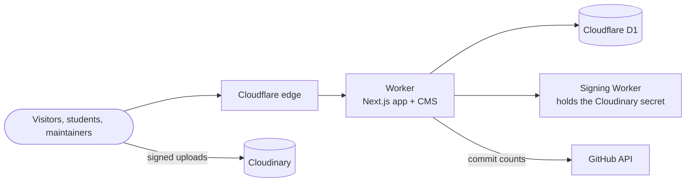

<div align="center">


# GitHub Community GITAM

**The website of the GitHub Community club at GITAM University, Hyderabad.**

A home for the club: who we are, what we have run, what we build, and how to
get involved. Plus the CMS our maintainers use to keep all of it current.

[](https://nextjs.org)
[](https://react.dev)
[](https://www.typescriptlang.org)
[](https://tailwindcss.com)
[](https://developers.cloudflare.com/workers/)
[](https://cloudinary.com)

[Features](#features) ·
[Tech stack](#tech-stack) ·
[Quick start](#quick-start) ·
[Documentation](#documentation) ·
[Contributing](#contributing)

</div>

---

## About the club

GitHub Community GITAM is a student club for people who like building
things with code and doing it together. The club works on projects that are
useful to students on campus, runs events, and builds things for fun.

There are two ways in:

- **The community group** is a WhatsApp group open to every GITAM student.
  No application needed; the QR code is on the website.
- **The club** recruits in rounds, with an interview. Experience is not the
  filter. The application form is on the homepage.

## Features

### For everyone

- **A single long homepage** covering the club's story, its journey so far,
  the executive board, past events with photo galleries, projects, ideas
  from students, featured builds, what members get out of it, and how to
  join.
- **Members page** with every member grouped by team. Members use
  illustrated avatars rather than photos.
- **Project pages** with the team behind each one, its stack, and a live
  commit count from GitHub.
- **A 3D Octocat** that follows your cursor and walks down the page beside
  you, docking next to each section.

### For students

- **Propose an idea** for something the club could build, in a friendly
  one-question-at-a-time form. No account needed.
- **Submit something you built** to be featured on the builds page, with
  screenshots.
- **Track your submission** through a private link, without signing up.
- **Apply to join** the club from the homepage.

### For maintainers

- **A complete CMS** for the board, events, journey, projects, members,
  teams, proposals, builds and applications. No code changes to update the
  site.
- **Image uploads** straight to Cloudinary, with drag and drop and galleries.
- **Review queues** for proposals and builds, with counts in the nav.
- **Security built in:** the CMS lives at a secret address behind a
  password, with a login lockout and a security log.
- **A honeypot at `/admin`** that entertains whoever tries it, and writes
  down that they did.
- **Documentation inside the CMS**, the same files as the `docs/` folder.

## Tech stack

| Area      | Technology                                                                     |
| --------- | ------------------------------------------------------------------------------ |
| Framework | [Next.js 16](https://nextjs.org) (App Router), React 19, TypeScript            |
| Styling   | Tailwind CSS 3, GitHub's dark palette, Geist and Geist Mono                    |
| Motion    | framer-motion, Lenis smooth scrolling, the View Transitions API                |
| 3D        | Three.js with react-three-fiber and drei                                       |
| Hosting   | A Cloudflare Worker, built with [OpenNext](https://opennext.js.org/cloudflare) |
| Database  | [Cloudflare D1](https://developers.cloudflare.com/d1/) (SQLite)                |
| Media     | [Cloudinary](https://cloudinary.com), signed by a separate small Worker        |

## Architecture



The whole site, CMS included, runs as one Cloudflare Worker. Pages are
rendered on the server and read the database on every request, so a change
saved in the CMS is live on the next page load. A full walkthrough is in
[docs/02-architecture.md](docs/02-architecture.md).

## Quick start

You need Node.js 20+, npm, and a (free) Cloudflare account with
`npx wrangler login` done once.

```bash
git clone https://github.com/Git-HubCommunityGitamHyd/Github-Community-Club-Website.git
cd Github-Community-Club-Website
npm install
cp .env.example .env
```

Fill in `ADMIN_PASSWORD`, `SESSION_SECRET` (`openssl rand -hex 32`) and
`ADMIN_PATH` (`openssl rand -hex 12`) in `.env`, then:

```bash
npm run db:migrate:local
npm run dev
```

- Website: <http://localhost:3000>
- CMS: `http://localhost:3000/<your ADMIN_PATH>`

There is no database to install: `next dev` gets a local D1 through
wrangler. Image uploads additionally need the signing Worker; see
[docs/03-local-development.md](docs/03-local-development.md).

### Useful scripts

| Command                          | What it does                               |
| -------------------------------- | ------------------------------------------ |
| `npm run dev`                    | Start the dev server with a local database |
| `npm run build`                  | Production build                           |
| `npm test`                       | Regression tests                           |
| `npm run lint`                   | ESLint                                     |
| `npm run format`                 | Prettier                                   |
| `npm run db:migrate:local`       | Create the local database schema           |
| `npm run db:patch:local -- FILE` | Run one migration locally                  |
| `npm run deploy`                 | Build and deploy to Cloudflare             |

## Project structure

```
app/                  routes: pages, layouts and API handlers
  admin/              the CMS (served at a secret path, see docs)
  api/                public form endpoints and admin CRUD
features/             UI grouped by domain (home, members, builds, mascot, admin…)
components/ui/        generic building blocks
lib/                  database access, validation, auth, uploads, GitHub
db/                   schema.sql and migrations/
docs/                 long-form documentation
workers/              the Cloudinary signing Worker
public/               site assets (Octocat model, logo, QR code)
proxy.ts              routes the secret CMS path and the /admin honeypot
```

## Documentation

Everything about how the site works lives in [`docs/`](docs/README.md), and
is also readable inside the CMS. **Taking over the site?** Start with the
[Guide for a new board](docs/12-new-board-guide.md).

| Guide                                               | Covers                                        |
| --------------------------------------------------- | --------------------------------------------- |
| [Overview](docs/01-overview.md)                     | What the site is, who uses it, glossary       |
| [Architecture](docs/02-architecture.md)             | How the pieces fit, request flow, code layout |
| [Local development](docs/03-local-development.md)   | Setup, scripts, conventions                   |
| [Deployment](docs/04-deployment.md)                 | Cloudflare, secrets, releases, rollbacks      |
| [Database](docs/05-database.md)                     | Tables, diagrams, migrations, backups         |
| [CMS and security](docs/06-cms-and-security.md)     | Logins, secret path, honeypot, private data   |
| [Content workflows](docs/07-content-workflows.md)   | Proposals, builds, applications, track links  |
| [Media and uploads](docs/08-media-and-uploads.md)   | Cloudinary and the signing Worker             |
| [Frontend](docs/09-frontend.md)                     | Homepage, mascot, motion, palette             |
| [Operations runbook](docs/10-operations-runbook.md) | Handover, secrets, backups, troubleshooting   |
| [API reference](docs/11-api-reference.md)           | Every endpoint, its fields and responses      |
| [Guide for a new board](docs/12-new-board-guide.md) | Taking over the site, A to Z                  |

## Contributing

Club members are welcome to contribute.

1. Read [Local development](docs/03-local-development.md), especially the
   conventions, and `CLAUDE.md` for the sharp edges.
2. Branch from `main`, make your change, and check it in the browser.
3. Before opening a pull request, run:
   ```bash
   npm test && npx tsc --noEmit && npm run lint && npm run format:check && npm run build
   ```
4. If you changed how something works, update the matching file in `docs/`.
5. Open a pull request describing what changed and how you checked it.

Please never commit secrets, the CMS address, or exports of the database.
The database holds students' personal details.

## Credits

- Built and maintained by the members of GitHub Community GITAM.
- "GitHub Octocat" 3D model by pissang, licensed under
  [CC BY 4.0](http://creativecommons.org/licenses/by/4.0/).
- GitHub, the GitHub logo and the Octocat are trademarks of GitHub, Inc.
  This is a student club site and is not affiliated with or endorsed by
  GitHub.
