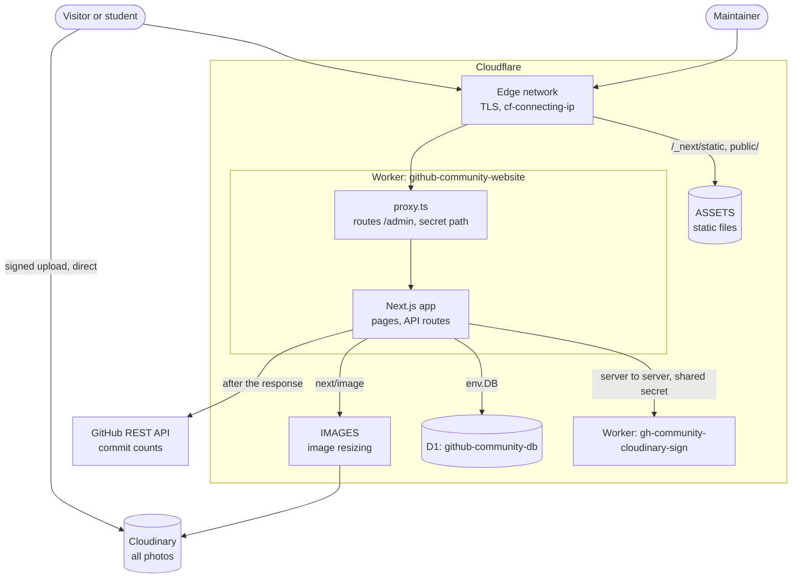
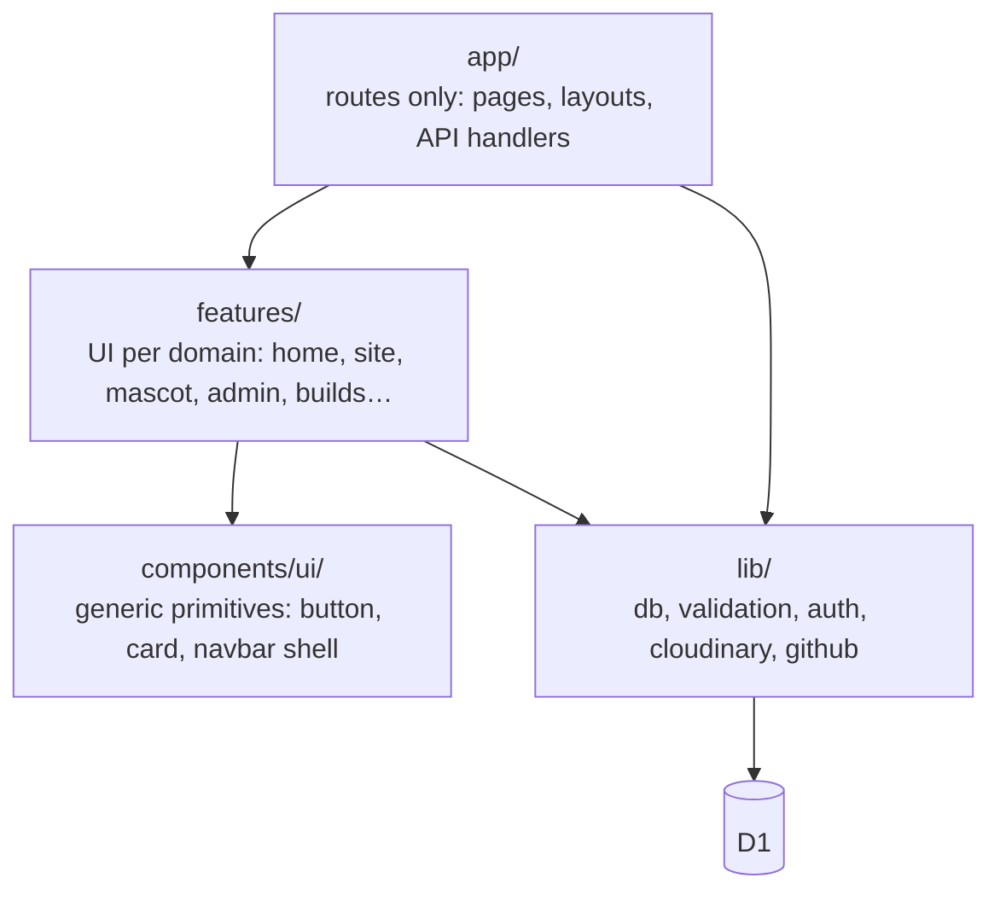
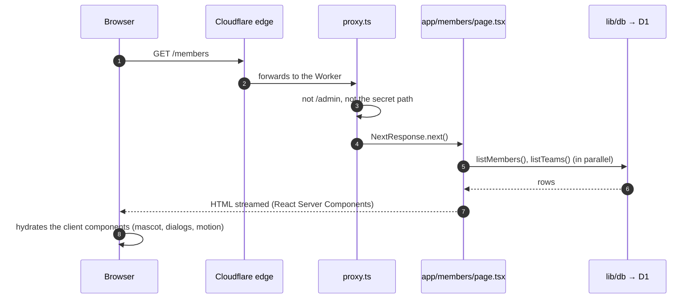
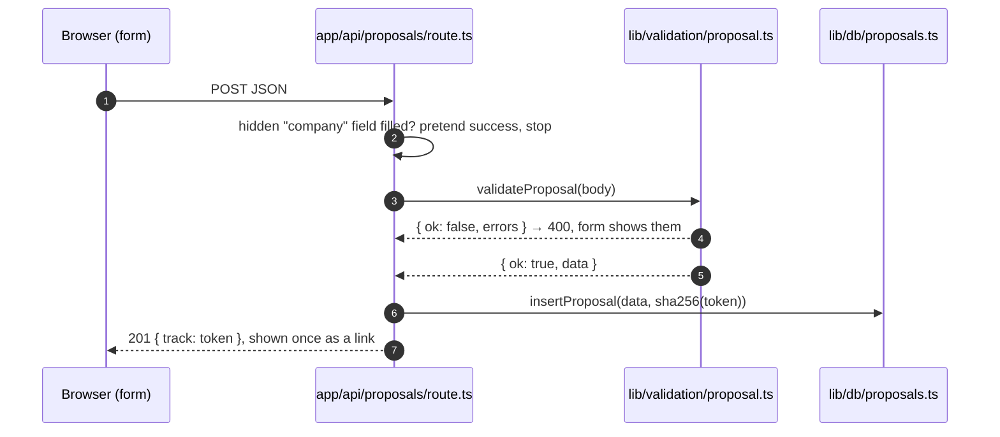
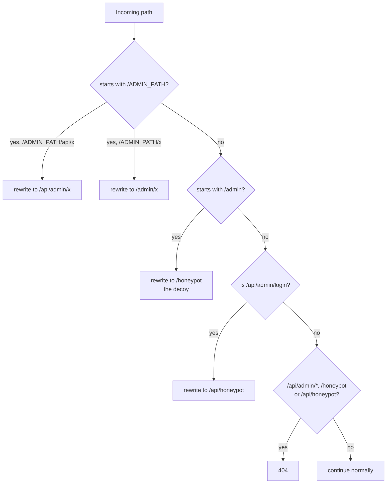

# Architecture

## The system at a glance

Everything the site does happens inside **one Cloudflare Worker**. There is
no separate API server, no database server to keep running and no Vercel.
The second, much smaller Worker exists only so the Cloudinary API secret
never has to be given to the main app.

## Layers of the codebase

| Folder            | Holds                                                                                  | Rule                                                |
| ----------------- | -------------------------------------------------------------------------------------- | --------------------------------------------------- |
| `app/`            | Routes. Each `page.tsx` fetches data and composes components                           | Keep logic out; fetch, then hand to a component     |
| `features/`       | Everything visible, grouped by domain (`home/`, `builds/`, `admin/`, `mascot/`…)       | One folder per domain                               |
| `components/ui/`  | Generic building blocks with no knowledge of the club                                  | No database or domain imports                       |
| `lib/db/`         | One file per table. The only code that writes SQL                                      | Public queries name their columns, never `SELECT *` |
| `lib/validation/` | One file per form. Plain functions returning `{ ok, data }` or `{ ok: false, errors }` | Shared by the API route and nothing else            |
| `lib/auth/`       | Session cookie, admin URL mapping, request info                                        |                                                     |
| `lib/cloudinary/` | Upload folders and the browser upload helper                                           |                                                     |
| `lib/github/`     | Commit counts for projects and builds                                                  |                                                     |
| `workers/`        | The Cloudinary signing Worker, deployed on its own                                     | Not part of the Next.js build                       |
| `db/`             | `schema.sql` and one-off `migrations/`                                                 |                                                     |
| `docs/`           | This documentation                                                                     |                                                     |
| `public/`         | Site assets only: the Octocat model, logo, WhatsApp QR, doodle tile                    | Never photos of people or events                    |

There is no `src/` folder. The import alias `@/` points at the repository
root, so `@/lib/db/events` is `lib/db/events.ts`.

## How a page request is served

Every page that reads the database declares
`export const dynamic = "force-dynamic"`. Without it Next.js would render the
page once at build time and serve that snapshot forever. This has bitten the
project before; do not remove it.

## How a form submission is handled

The same shape is used for applications, builds and every CMS save: parse,
validate with a plain function, write through `lib/db`, answer with JSON.

## Server and client components

Next.js renders components on the server by default. A file that starts
with `"use client"` is sent to the browser too, and is the only kind that can
use state, effects, event handlers or the 3D mascot.

- Pages (`app/**/page.tsx`) are server components. They query D1 and pass
  plain data down.
- Interactive pieces (the homepage shell, dialogs, forms, the mascot) are
  client components.
- A helper that a server component calls must live in a plain module, not a
  `"use client"` file, or it throws at runtime. `features/builds/format.ts`
  exists for exactly this reason.

## Routing rules added by `proxy.ts`

`proxy.ts` (Next.js 16's name for middleware) runs before every request
except static files. It does one thing: decide which URL the CMS answers on.

Details and the reasoning are in [CMS and security](./06-cms-and-security.md).

## Background work

Some work happens after the response is sent, using Next's `after()`:

- **Commit counts.** Project and build pages show how many commits their
  GitHub repository has. The number is stored in D1. When a page is viewed
  and the stored number is older than a day, the page is served with the old
  number and a refresh runs afterwards (`lib/github/commits.ts`). Saving a
  project or build in the CMS refreshes it immediately. An optional
  `GITHUB_TOKEN` raises GitHub's rate limit.

There are no cron jobs and no queues.

## Key technology choices

| Choice                               | Why                                                                                      |
| ------------------------------------ | ---------------------------------------------------------------------------------------- |
| Next.js App Router                   | Server components query the database directly; no separate API layer for page data       |
| Cloudflare Workers via OpenNext      | Free tier covers a club site; D1 and the Worker live together with no connection strings |
| D1 (SQLite)                          | A handful of small tables. Managed, backed up by Cloudflare, nothing to run              |
| Cloudinary                           | Upload, storage, resizing and a media library the maintainers can browse                 |
| No auth library                      | One shared password for a few maintainers; a signed cookie needs no session store        |
| framer-motion (never `motion/react`) | One animation runtime, so the site-wide reduced-motion setting reaches every animation   |
| Tailwind CSS 3                       | Utility classes; the GitHub dark palette is defined as `gh.*` colours                    |
| Three.js via react-three-fiber       | The 3D Octocat mascot                                                                    |
