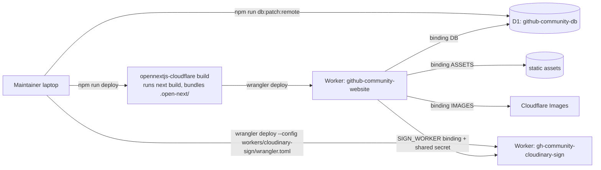
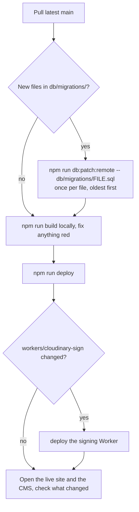

# Deployment

## Where it runs

| Piece             | Where                                       | Name                                                     |
| ----------------- | ------------------------------------------- | -------------------------------------------------------- |
| The website + CMS | Cloudflare Worker, built by OpenNext        | `github-community-website`                               |
| Static files      | Cloudflare Workers static assets (`ASSETS`) | served by the same Worker                                |
| Database          | Cloudflare D1                               | `github-community-db`                                    |
| Upload signer     | A second Cloudflare Worker                  | `gh-community-cloudinary-sign`                           |
| Images            | Cloudinary                                  | the club's Cloudinary account                            |
| Source code       | GitHub                                      | `Git-HubCommunityGitamHyd/Github-Community-Club-Website` |

It is **not** deployed to Vercel, and nothing deploys automatically on push.
Deploys are run by a maintainer from a laptop with `npm run deploy`.



## Accounts

| Service    | Account                                            | Where to look                                  |
| ---------- | -------------------------------------------------- | ---------------------------------------------- |
| Cloudflare | The club's own account (hosts both Workers and D1) | dash.cloudflare.com, Workers and Pages, D1     |
| Cloudinary | Cloud name `rhwz26x7` (club account)               | console.cloudinary.com, Media Library (Assets) |
| GitHub     | Organisation `Git-HubCommunityGitamHyd`            | the repository                                 |

Everything that deploys (`npm run deploy`, `db:*:remote`, `wrangler secret`)
acts on whichever Cloudflare account `npx wrangler login` signed into. Run
`npx wrangler whoami` before any remote command to check it is the club's.

History: until September 2026 local development used a signing Worker in a
member's personal Cloudflare account and a Cloudinary cloud `djks4viyu`.
Both were replaced by club-owned ones (workers.dev subdomain
`gh-community-gitam`, Cloudinary `rhwz26x7`) and production started from an
empty database. The personal Worker should be deleted by its owner.

## The Worker's configuration

`wrangler.jsonc` at the repo root is the Worker's configuration:

| Setting                              | Value / purpose                                                  |
| ------------------------------------ | ---------------------------------------------------------------- |
| `main`                               | `.open-next/worker.js`, produced by the OpenNext build           |
| `compatibility_flags`                | `nodejs_compat`, so Node APIs like `node:crypto` work            |
| `assets` (`ASSETS`)                  | `.open-next/assets`: `_next/static` and everything in `public/`  |
| `d1_databases` (`DB`)                | The database. `lib/db/client.ts` reads it per request            |
| `images` (`IMAGES`)                  | Used by OpenNext to resize images for `next/image`               |
| `services` (`WORKER_SELF_REFERENCE`) | OpenNext calls the Worker itself for cache revalidation          |
| `services` (`SIGN_WORKER`)           | How the site reaches the upload signer in production (see below) |
| `observability`                      | Logs visible in the Cloudflare dashboard                         |

`WORKER_SELF_REFERENCE` must name the Worker itself
(`github-community-website`). It once named `github-community-portfolio`,
the old package name, and was corrected before the first deploy. If you
rename the Worker, change both `name` and this service, then run
`npm run cf-typegen`. That command also reads `.env` and declares every
variable in it as a required string, which breaks type checks; keep only
the binding changes from its output.

`open-next.config.ts` is OpenNext's config. It is the default; no
incremental cache is configured, which is fine because every data page is
rendered per request.

## Secrets and settings

Production settings are **Worker secrets**, set once with wrangler and never
committed:

```bash
npx wrangler secret put ADMIN_PASSWORD
npx wrangler secret put SESSION_SECRET
npx wrangler secret put ADMIN_PATH
npx wrangler secret put UPLOAD_SIGN_URL
npx wrangler secret put WORKER_SHARED_SECRET
npx wrangler secret put GITHUB_TOKEN        # optional
```

Use **fresh values for production**, not the ones in your local `.env`.

`opennextjs-cloudflare build` copies every `.env` file it finds into the
Worker bundle as fallback values, which would ship your laptop's password
and CMS path inside the production Worker. So `npm run deploy` and
`npm run upload` run the build through `scripts/without-local-env.mjs`,
which moves `.env` files aside for the build and restores them afterwards.
Never run `opennextjs-cloudflare build` directly for a deploy. (If a build is
interrupted hard, a file named `.env.moved-aside-for-build` may be left
behind; rename it back to `.env`.)

The signing Worker lives at
`https://gh-community-cloudinary-sign.gh-community-gitam.workers.dev`; the
site's `UPLOAD_SIGN_URL` is that plus `/sign`.

In production the site does **not** call that URL. A Worker fetching another
Worker's `workers.dev` address in the same Cloudflare account is blocked by
Cloudflare's loopback protection and fails with a 502, so the site calls
the signer through the `SIGN_WORKER` service binding in `wrangler.jsonc`
(`lib/cloudinary/sign.ts`). `UPLOAD_SIGN_URL` is only used by `npm run dev`.
If you rename the signing Worker, update that binding.

The signing Worker has its own secrets:

```bash
cd workers/cloudinary-sign
npx wrangler secret put WORKER_SHARED_SECRET  --config ./wrangler.toml
npx wrangler secret put CLOUDINARY_API_KEY    --config ./wrangler.toml
npx wrangler secret put CLOUDINARY_API_SECRET --config ./wrangler.toml
npx wrangler secret put CLOUDINARY_CLOUD_NAME --config ./wrangler.toml
```

Always pass `--config ./wrangler.toml` inside `workers/cloudinary-sign`.

The site checks what the signing Worker signed: a reply that does not echo
back the requested `folder` and `allowed_formats` in `params` is refused
(CMS uploads get a 502, the public build form a 503). A signing Worker
deployed before those restrictions existed replies without `params`, so
**redeploy it whenever `workers/cloudinary-sign/src` changes**, and after
setting it up in a new account.
Without it wrangler finds the root `wrangler.jsonc` and acts on the main site.

## First deploy (from nothing)

1. `npx wrangler login`.
2. Create the database if it does not exist:
   `npx wrangler d1 create github-community-db`, and put the printed
   `database_id` into `wrangler.jsonc`.
3. Create the schema: `npm run db:migrate:remote`. (On a brand-new database
   `schema.sql` already includes every column, so no migration files are
   needed.)
4. Deploy the signing Worker (commands above), note its URL.
5. Set the main Worker's secrets. `UPLOAD_SIGN_URL` is the signing Worker's
   URL plus `/sign`.
6. `npm run deploy`.
7. Log into the CMS at `https://<domain>/<ADMIN_PATH>` and add content.

## Routine deploy



Run migrations **before** deploying code that needs them. Migration files run
exactly once per database; running one twice errors, and that is harmless but
noisy. Note each one you run on production in
[Database](./05-database.md#migration-history) so the next maintainer knows.

## Optional: Cloudflare Access in front of the CMS

**Not set up, by decision (September 2026).** The CMS is protected by the
secret path, a strong password and the lockout, which the board judged
enough. Access is the upgrade if that ever changes: Cloudflare then asks for
a listed maintainer's email (one-time code) before a request reaches the
site at all, so a leaked address or password alone is not enough.

It needs a custom domain: on the `workers.dev` address Access can only lock
the whole hostname, which would hide the public site too. Zero Trust's free
plan covers up to 50 users. Steps, once a custom domain exists:

1. Cloudflare dashboard, **Zero Trust**, **Access**, **Applications**, **Add
   an application**, **Self-hosted**.
2. Application domain: the site's domain, path `<ADMIN_PATH>` (so it covers
   `/<ADMIN_PATH>` and everything under it).
3. Policy: **Allow**, include **Emails**, list each maintainer's email.
4. Login method: one-time PIN is enough.

If you set it up, maintainers are added and removed in that policy; update
the runbook's handover checklist to say so.

## Custom domain

In the Cloudflare dashboard, open the Worker, **Settings**, **Domains and
Routes**, **Add**, **Custom domain**. The domain's DNS must be on Cloudflare.
If Cloudflare Access is set up, point its application at the new domain.

## Rolling back

- **Code:** Cloudflare dashboard, the Worker, **Deployments**, pick the
  previous version, **Rollback**. Or check out the previous commit and
  `npm run deploy`.
- **Database:** D1 keeps a point-in-time history (Time Travel). Restore with
  `npx wrangler d1 time-travel restore github-community-db --timestamp=<ISO time>`.
  This rewinds every table, so export first (see the runbook). Migrations that
  added columns are not undone by rolling back code.

## Logs

Cloudflare dashboard, the Worker, **Logs** (observability is on), or live:

```bash
npx wrangler tail github-community-website
```
