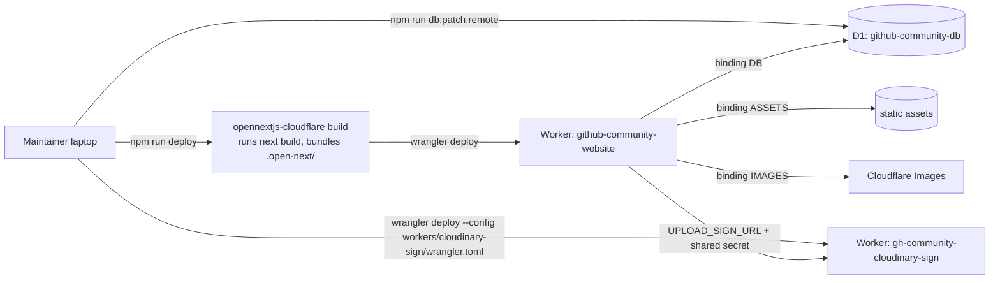
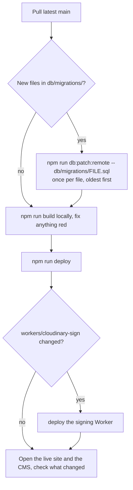

# Deployment

## Where it runs

| Piece             | Where                                       | Name                                                     |
| ----------------- | ------------------------------------------- | -------------------------------------------------------- |
| The website + CMS | Cloudflare Worker, built by OpenNext        | `github-community-website`                               |
| Static files      | Cloudflare Workers static assets (`ASSETS`) | served by the same Worker                                |
| Database          | Cloudflare D1                               | `github-community-db`                                    |
| Upload signer     | A second Cloudflare Worker                  | `gh-community-cloudinary-sign`                           |
| Images            | Cloudinary                                  | the club's Cloudinary account                            |
| Source code       | GitHub                                      | `Git-HubCommunityGitamHyd/Github-Community-Club-Website` |

It is **not** deployed to Vercel, and nothing deploys automatically on push.
Deploys are run by a maintainer from a laptop with `npm run deploy`.



## The Worker's configuration

`wrangler.jsonc` at the repo root is the Worker's configuration:

| Setting                              | Value / purpose                                                 |
| ------------------------------------ | --------------------------------------------------------------- |
| `main`                               | `.open-next/worker.js`, produced by the OpenNext build          |
| `compatibility_flags`                | `nodejs_compat`, so Node APIs like `node:crypto` work           |
| `assets` (`ASSETS`)                  | `.open-next/assets`: `_next/static` and everything in `public/` |
| `d1_databases` (`DB`)                | The database. `lib/db/client.ts` reads it per request           |
| `images` (`IMAGES`)                  | Used by OpenNext to resize images for `next/image`              |
| `services` (`WORKER_SELF_REFERENCE`) | OpenNext calls the Worker itself for cache revalidation         |
| `observability`                      | Logs visible in the Cloudflare dashboard                        |

> **Known issue.** `WORKER_SELF_REFERENCE` points at the service
> `github-community-portfolio`, but the Worker is named
> `github-community-website`. They must match. Fix the service name before
> the next deploy, then run `npm run cf-typegen`.

`open-next.config.ts` is OpenNext's config. It is the default; no
incremental cache is configured, which is fine because every data page is
rendered per request.

## Secrets and settings

Production settings are **Worker secrets**, set once with wrangler and never
committed:

```bash
npx wrangler secret put ADMIN_PASSWORD
npx wrangler secret put SESSION_SECRET
npx wrangler secret put ADMIN_PATH
npx wrangler secret put UPLOAD_SIGN_URL
npx wrangler secret put WORKER_SHARED_SECRET
npx wrangler secret put GITHUB_TOKEN        # optional
```

Use **fresh values for production**, not the ones in your local `.env`.
Next.js reads `.env` files during the build, so build from a checkout whose
`.env` holds only development values, and after the first deploy confirm the
live site uses the production `ADMIN_PATH` (the local one should 404).

The signing Worker has its own secrets:

```bash
cd workers/cloudinary-sign
npx wrangler secret put WORKER_SHARED_SECRET  --config ./wrangler.toml
npx wrangler secret put CLOUDINARY_API_KEY    --config ./wrangler.toml
npx wrangler secret put CLOUDINARY_API_SECRET --config ./wrangler.toml
npx wrangler secret put CLOUDINARY_CLOUD_NAME --config ./wrangler.toml
```

Always pass `--config ./wrangler.toml` inside `workers/cloudinary-sign`.
Without it wrangler finds the root `wrangler.jsonc` and acts on the main site.

## First deploy (from nothing)

1. `npx wrangler login`.
2. Create the database if it does not exist:
   `npx wrangler d1 create github-community-db`, and put the printed
   `database_id` into `wrangler.jsonc`.
3. Create the schema: `npm run db:migrate:remote`. (On a brand-new database
   `schema.sql` already includes every column, so no migration files are
   needed.)
4. Deploy the signing Worker (commands above), note its URL.
5. Set the main Worker's secrets. `UPLOAD_SIGN_URL` is the signing Worker's
   URL plus `/sign`.
6. `npm run deploy`.
7. Put **Cloudflare Access** in front of the CMS (next section).
8. Log into the CMS at `https://<domain>/<ADMIN_PATH>` and add content.

## Routine deploy



Run migrations **before** deploying code that needs them. Migration files run
exactly once per database; running one twice errors, and that is harmless but
noisy. Record in `TODO.md` which ones production has had (see
[Database](./05-database.md#migration-ledger)).

## Cloudflare Access (protects the CMS)

The secret path hides the CMS. Access actually locks it: with it, Cloudflare
asks for a maintainer's email before the request reaches the site at all.

1. Cloudflare dashboard, **Zero Trust**, **Access**, **Applications**, **Add
   an application**, **Self-hosted**.
2. Application domain: the site's domain, path `<ADMIN_PATH>` (so it covers
   `/<ADMIN_PATH>` and everything under it).
3. Policy: **Allow**, include **Emails**, list each maintainer's email.
4. Login method: one-time PIN is enough.

When a maintainer leaves, remove their email here. See the
[Operations runbook](./10-operations-runbook.md).

## Custom domain

In the Cloudflare dashboard, open the Worker, **Settings**, **Domains and
Routes**, **Add**, **Custom domain**. The domain's DNS must be on Cloudflare.
Update the Access application to the new domain afterwards.

## Rolling back

- **Code:** Cloudflare dashboard, the Worker, **Deployments**, pick the
  previous version, **Rollback**. Or check out the previous commit and
  `npm run deploy`.
- **Database:** D1 keeps a point-in-time history (Time Travel). Restore with
  `npx wrangler d1 time-travel restore github-community-db --timestamp=<ISO time>`.
  This rewinds every table, so export first (see the runbook). Migrations that
  added columns are not undone by rolling back code.

## Logs

Cloudflare dashboard, the Worker, **Logs** (observability is on), or live:

```bash
npx wrangler tail github-community-website
```
