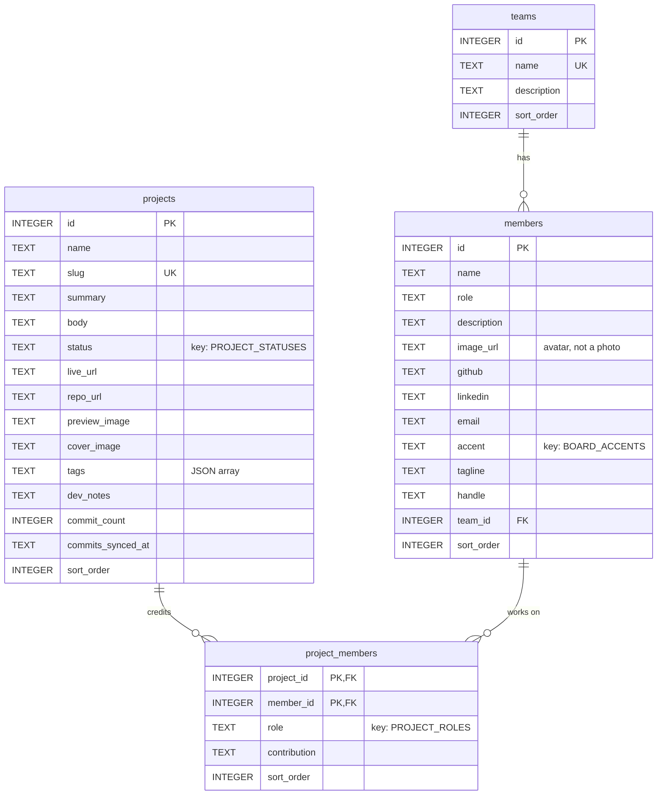
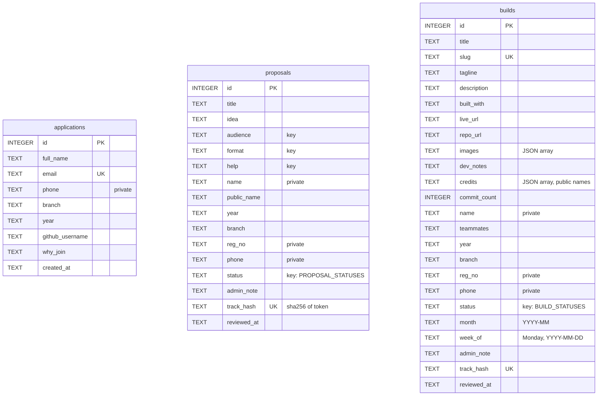
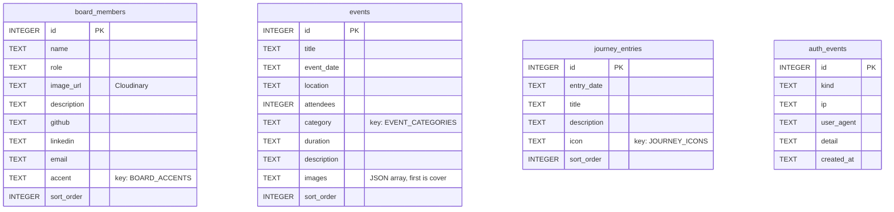
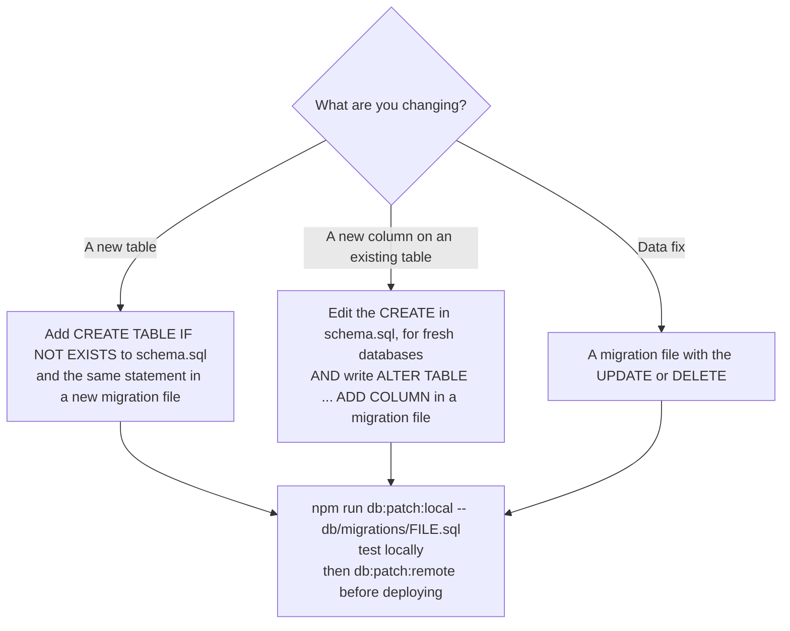

# Database

## What it is

The site has one database: **Cloudflare D1**, a managed SQLite database
named `github-community-db`. The Worker reaches it through the `DB` binding;
there is no connection string, no password and no server to run.

- Schema: [`db/schema.sql`](../db/schema.sql), the complete current schema.
- Changes to existing tables: one-off files in `db/migrations/` (see
  [Changing the schema](#changing-the-schema)).
- Access: only through `lib/db/*.ts`, one file per table.

```ts
// lib/db/client.ts
export async function getDb() {
  const { env } = await getCloudflareContext({ async: true })
  return env.DB
}
```

Every query uses D1's prepared statements, which bind values safely:

```ts
await db
  .prepare("SELECT id, name FROM members WHERE team_id = ?")
  .bind(teamId)
  .all()
```

## Tables

### People and projects



### Submissions from students

These three hold personal data. See [Private columns](#things-that-are-not-obvious).



### Site content and the security log



Every table also has `created_at`, an ISO-8601 UTC timestamp set by the
database.

| Table             | Holds                                       | Edited in             | Public?                                       |
| ----------------- | ------------------------------------------- | --------------------- | --------------------------------------------- |
| `applications`    | Join form submissions                       | CMS (read only)       | Never                                         |
| `board_members`   | The executive board on the homepage         | CMS → Board           | Yes, except email is only a contact link      |
| `events`          | Past events with photos                     | CMS → Events          | Yes                                           |
| `journey_entries` | The homepage timeline of milestones         | CMS → Journey         | Yes                                           |
| `projects`        | What the club builds                        | CMS → Projects        | Yes                                           |
| `teams`           | Club teams members belong to                | CMS → Teams           | Yes                                           |
| `members`         | Everyone in the club, with avatars          | CMS → Members         | Yes                                           |
| `project_members` | Who worked on which project, and their role | CMS → Projects        | Yes                                           |
| `proposals`       | Ideas students sent in                      | CMS → Proposals       | Only public statuses, never name/phone/reg no |
| `builds`          | Students' own builds                        | CMS → Builds          | Only accepted, never phone/reg no             |
| `auth_events`     | CMS logins and honeypot hits                | CMS → Security (read) | Never                                         |

## Things that are not obvious

**No arrays or JSON columns.** SQLite has neither, so lists
(`events.images`, `projects.tags`, `builds.images`, `builds.credits`) are
stored as JSON text. The encoding and decoding lives entirely inside the
matching `lib/db` file; every caller sees a normal array.

**Choices are keys.** Columns like `status`, `category`, `icon` and `accent`
hold a short key. The label, icon and colour come from a lookup in
`features/` (for example `features/projects/statuses.ts`). An unknown key
renders a fallback rather than crashing. Do not store labels, colours or
HTML in the database.

**Private columns.** `phone`, `reg_no` and the submitter's full `name` exist
so the club can contact people. Public queries select named columns, so a
private column is never sent unless someone types it into a public query.
When you add a column, decide whether it is private before anything else.

**Track links store only a hash.** `track_hash` is the SHA-256 of the random
token in a submitter's status link. The token itself is never stored, so
neither a database backup nor an admin screen can produce a working link.

**Sort order.** Tables shown in a list have `sort_order`; lower numbers come
first. The CMS exposes it as a number field.

**Deleting.** Deleting a team leaves its members, teamless
(`ON DELETE SET NULL`). Deleting a project or member removes their
`project_members` rows (`ON DELETE CASCADE`). Deleting a row does not delete
its images from Cloudinary.

**Unique constraints** (`applications.email`, `projects.slug`,
`builds.slug`, `teams.name`): D1 reports a violation as an error whose
message contains `UNIQUE constraint failed`. The API routes catch that and
answer 409 with a friendly message.

## Changing the schema

`db/schema.sql` is all `CREATE TABLE IF NOT EXISTS`. Running it creates
missing tables and does nothing to tables that exist. SQLite has no
`ADD COLUMN IF NOT EXISTS`. So:



Name migration files `YYYY-MM-short-description.sql` and start each with a
comment saying what it does and why. Each runs **exactly once per database**.
A repeated `ALTER ... ADD COLUMN` fails with "duplicate column", which is how
you find out it already ran.

### Migration history

Production was rebuilt from `schema.sql` on 25 September 2026 (a fresh,
empty database in the club's Cloudflare account), so every earlier migration
is already part of the schema and the old files were removed. `db/migrations/`
starts empty from there.

When you add one, list it here with the date you ran it on production:

| File       | What it does | Run on production |
| ---------- | ------------ | ----------------- |
| (none yet) |              |                   |

## Reading data by hand

```bash
# Local
npx wrangler d1 execute github-community-db --local  --command "SELECT COUNT(*) FROM applications"
# Production (careful: this is live data)
npx wrangler d1 execute github-community-db --remote --command "SELECT id, title, status FROM builds ORDER BY id DESC LIMIT 10"
```

Applications, proposals and builds contain students' phone numbers and
registration numbers. Do not paste query results into chats, issues or AI
tools.

## Backups

- **Time Travel:** D1 keeps a point-in-time history automatically and can
  restore to any moment in its retention window
  (`npx wrangler d1 time-travel info github-community-db`).
- **Export:** a full SQL dump for safekeeping:
  `npx wrangler d1 export github-community-db --remote --output backup.sql`.
  The file contains personal data; store it privately and delete old ones.
  `db/seed-data.sql` is git-ignored for this reason.
