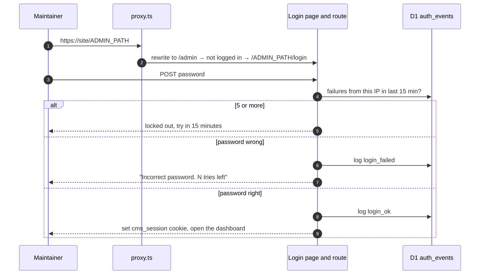

# CMS and security

## The CMS

Everything on the site that changes is edited in the CMS. It lives under
`app/admin/(dashboard)/` and has these screens:

| Screen           | Does                                                                      |
| ---------------- | ------------------------------------------------------------------------- |
| **Applications** | The dashboard home. Join form submissions, newest first                   |
| **Board**        | Executive board: photo, role, bio, links, profile ring colour, order      |
| **Events**       | Events with an ordered photo gallery; the first photo is the cover        |
| **Journey**      | The homepage timeline of milestones                                       |
| **Projects**     | Club projects: page content, images, status, team credits, repository     |
| **Members**      | Every member: avatar, tagline, team, links                                |
| **Teams**        | The teams members belong to                                               |
| **Proposals**    | Review student ideas; move them through statuses; leave a note            |
| **Builds**       | Review student builds; accept into a month, feature a week, edit the page |
| **Security**     | Logins, lockouts and honeypot hits                                        |
| **Docs**         | This documentation                                                        |

Proposals and Builds show a count of new submissions in the nav.

## How a maintainer gets in



There are two layers, independent of each other:

1. **The secret path.** The CMS answers only at `/<ADMIN_PATH>`. Anyone who
   guesses `/admin` gets the decoy.
2. **The password,** with a lockout after 5 wrong tries per IP in 15 minutes.

So the address and the password are both secrets. Share them only with
maintainers, privately, and change both when someone leaves. Cloudflare
Access (an email one-time code in front of the CMS) is a possible third
layer that was deliberately not set up; see
[Deployment](./04-deployment.md#optional-cloudflare-access-in-front-of-the-cms).

## The secret path, in detail

The CMS code lives at `app/admin/…` and `app/api/admin/…`, but those URLs are
never used from outside. `proxy.ts` maps them:

| Public URL                        | Served by                                              |
| --------------------------------- | ------------------------------------------------------ |
| `/<ADMIN_PATH>`                   | `app/admin/(dashboard)/page.tsx`                       |
| `/<ADMIN_PATH>/login`             | `app/admin/login/page.tsx`                             |
| `/<ADMIN_PATH>/board`             | `app/admin/(dashboard)/board/page.tsx`                 |
| `/<ADMIN_PATH>/api/board-members` | `app/api/admin/board-members/route.ts`                 |
| `/admin`, `/admin/anything`       | the honeypot, `app/honeypot/page.tsx`                  |
| `POST /api/admin/login`           | the honeypot's fake login, `app/api/honeypot/route.ts` |
| any other `/api/admin/…`          | 404                                                    |
| `/honeypot`, `/api/honeypot`      | 404 (only reachable by rewrite)                        |

`ADMIN_PATH` must be 16 to 64 lowercase letters, digits or dashes. If it is
missing or malformed, **no** CMS URL works at all; the app fails closed
rather than falling back to something guessable.

### Writing CMS code

Because the public URL differs from the file path, **never type an admin URL
directly** into a link, `fetch`, `router.push`, form `action` or redirect.
Name the internal route and pass it through the helper:

```tsx
// Server component, route handler or server helper
import { adminUrl } from "@/lib/auth/admin-path"
const link = <Link href={adminUrl("/admin/board/new")}>Add member</Link>
redirect(adminUrl("/admin/login"))

// Client component ("use client")
import { useAdminUrl } from "@/features/admin/admin-base"
const adminHref = useAdminUrl()
await fetch(adminHref(`/api/admin/events/${id}`), { method: "DELETE" })
```

A bare `/admin/...` link sends the maintainer to the decoy; a bare
`/api/admin/...` fetch gets a 404. The mapping itself is in
`lib/auth/admin-url.ts`.

The secret must never appear in anything public: robots.txt, a sitemap,
client code outside `app/admin`, a commit, a screenshot in an issue.

## Sessions

There is no user table and no session store. Logging in sets a cookie whose
value is `<expiry>.<signature>`, where the signature is a SHA-256 HMAC keyed
by `SESSION_SECRET` (`lib/auth/session.ts`). Checking it means recomputing
the signature, compared in constant time.

| Cookie attribute | Value             | Why                                                      |
| ---------------- | ----------------- | -------------------------------------------------------- |
| Name             | `cms_session`     |                                                          |
| Lifetime         | 8 hours           | A stolen cookie is worth hours, not days                 |
| `HttpOnly`       | yes               | JavaScript cannot read it                                |
| `Secure`         | yes in production | Only sent over HTTPS                                     |
| `SameSite`       | `Strict`          | Never sent on a request that starts on another site      |
| `Path`           | `/<ADMIN_PATH>`   | The public site never receives it; pages and API both do |

Because of `SameSite=Strict`, a CMS link opened from WhatsApp or email lands
on the login page. Reloading the page sends the cookie.

**Log everyone out:** change `SESSION_SECRET` (`wrangler secret put`). Every
existing cookie stops verifying.

### Where the checks are

- **Pages:** `requireAdminPage()` redirects to login. It is called in
  `app/admin/(dashboard)/layout.tsx` **and at the top of every page**. The
  second call is not redundant: Next.js renders a layout and its page in
  parallel, so a page without its own check can query the database and
  stream the result before the layout's redirect takes effect. This once
  leaked the applications list. Every new admin page must call it first.
- **API routes:** `requireAdminApi()` at the top of every handler under
  `app/api/admin/`, returning 401 without a valid cookie.

## Login lockout

Implemented in `app/api/admin/login/route.ts` with `lib/db/auth-events.ts`:

- Each wrong password writes a `login_failed` row with the client IP.
- Before checking a password, the route counts that IP's `login_failed` rows
  from the last 15 minutes, ignoring any before its last successful login.
  At 5 or more, it refuses without checking the password.
- The IP comes from `cf-connecting-ip`, which Cloudflare sets and a client
  cannot forge through Cloudflare.

Many students share one campus IP. Someone else's wrong guesses can lock a
maintainer out for up to 15 minutes. Wait, switch to mobile data, or clear
the lockout (see the runbook).

## The honeypot at /admin

Anyone who types `/admin` sees a convincing "Admin console" login. It is a
joke with a log attached:

- Every visit is logged (`honeypot_visit`, with the exact path tried).
- Every login attempt is logged with the **username only**
  (`honeypot_login`). The password is never sent from the browser.
- The error messages turn from believable into git jokes. The fifth try
  shows "Access granted", a clone that hangs at 99% and dies with HTTP 418,
  then a reveal page: "You found the honeypot", a `git blame` card with their
  IP, browser, username and time, and a link to apply to the club.
- "Forgot password?" opens a CAPTCHA asking for every square with a merge
  conflict. No answer passes.
- The 3D Octocat watches the cursor and looks away while they type.

Code: `features/honeypot/` and `app/honeypot/`. Writes are capped at 40 per
IP per 15 minutes so a scanner cannot fill the database.

URLs containing a dot (`/admin/.env`, `/admin.php`) and `/api/admin/*`
probes other than the login are plain 404s and are not logged.

## The Security page

`/<ADMIN_PATH>/security` shows the last 7 days in numbers (honeypot visits,
honeypot login tries, wrong passwords, successful logins), any IP locked out
right now, and the latest 200 events with time (IST), kind, IP, detail and
browser. Rows older than 90 days are deleted automatically.

## Public form protections

The public forms (join, proposals, builds) are not behind a login, so:

- Each has a hidden `company` field. People never see it; bots fill it. A
  filled one gets a fake success and nothing is stored.
- All input is validated server-side in `lib/validation/`.
- Build image uploads can only land in the `build-submissions` Cloudinary
  folder and only as images (see [Media and uploads](./08-media-and-uploads.md)).

Not yet in place (see the runbook's
[Known gaps](./10-operations-runbook.md#known-gaps)): rate limiting and Cloudflare
Turnstile on the public forms, and an upload size limit for public uploads.

## Private data

| Data                                          | Where          | Shown publicly?            |
| --------------------------------------------- | -------------- | -------------------------- |
| Applicant name, email, phone, why they joined | `applications` | Never                      |
| Proposal submitter name, phone, reg no        | `proposals`    | Never (only `public_name`) |
| Build submitter phone, reg no                 | `builds`       | Never                      |
| IP addresses and browsers                     | `auth_events`  | Never                      |

Members asked not to show their faces, so member images are avatars they
generate themselves ([Member avatar prompt](./member-avatar-prompt.md)).
