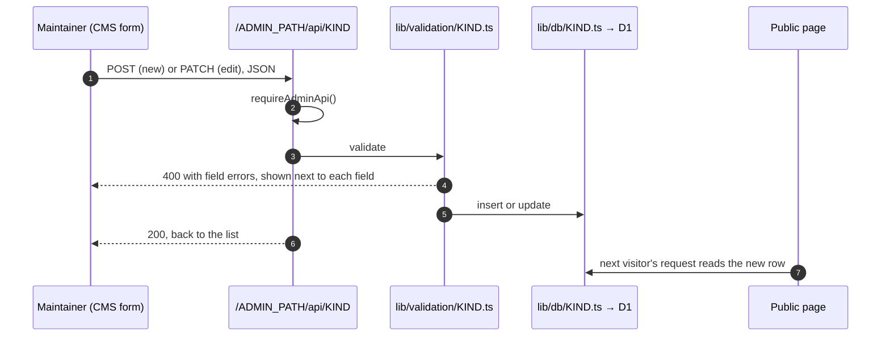
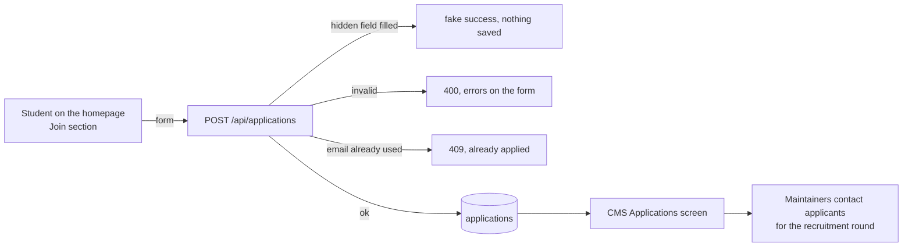
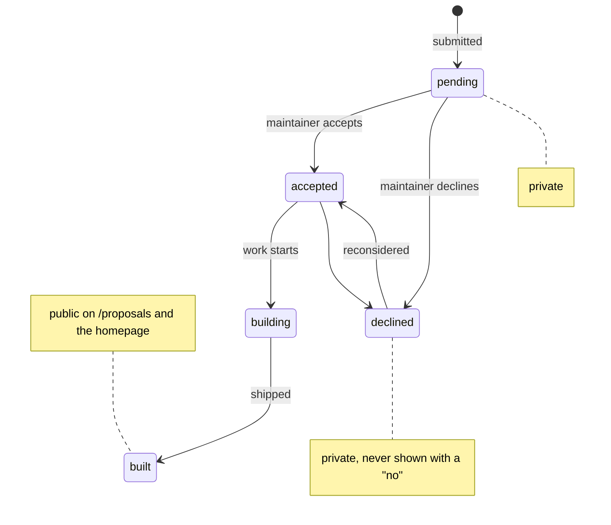
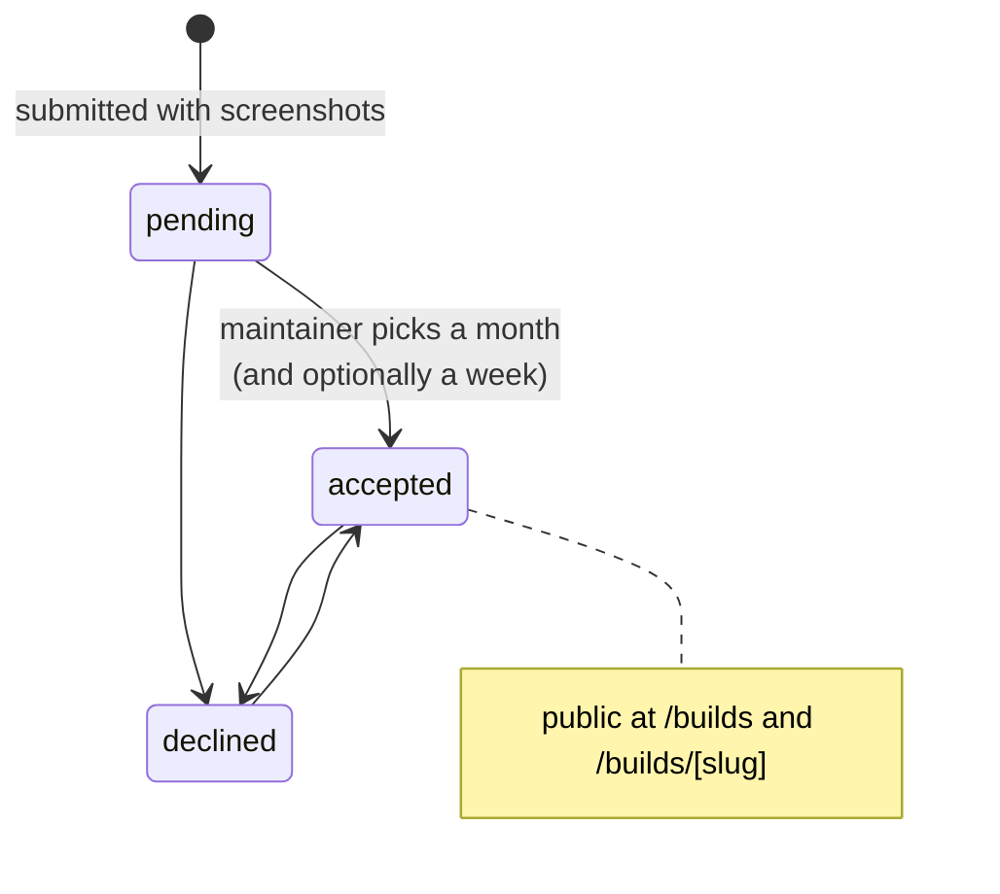
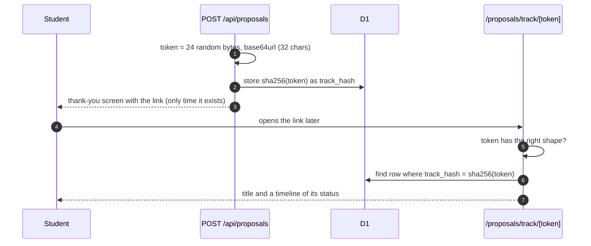
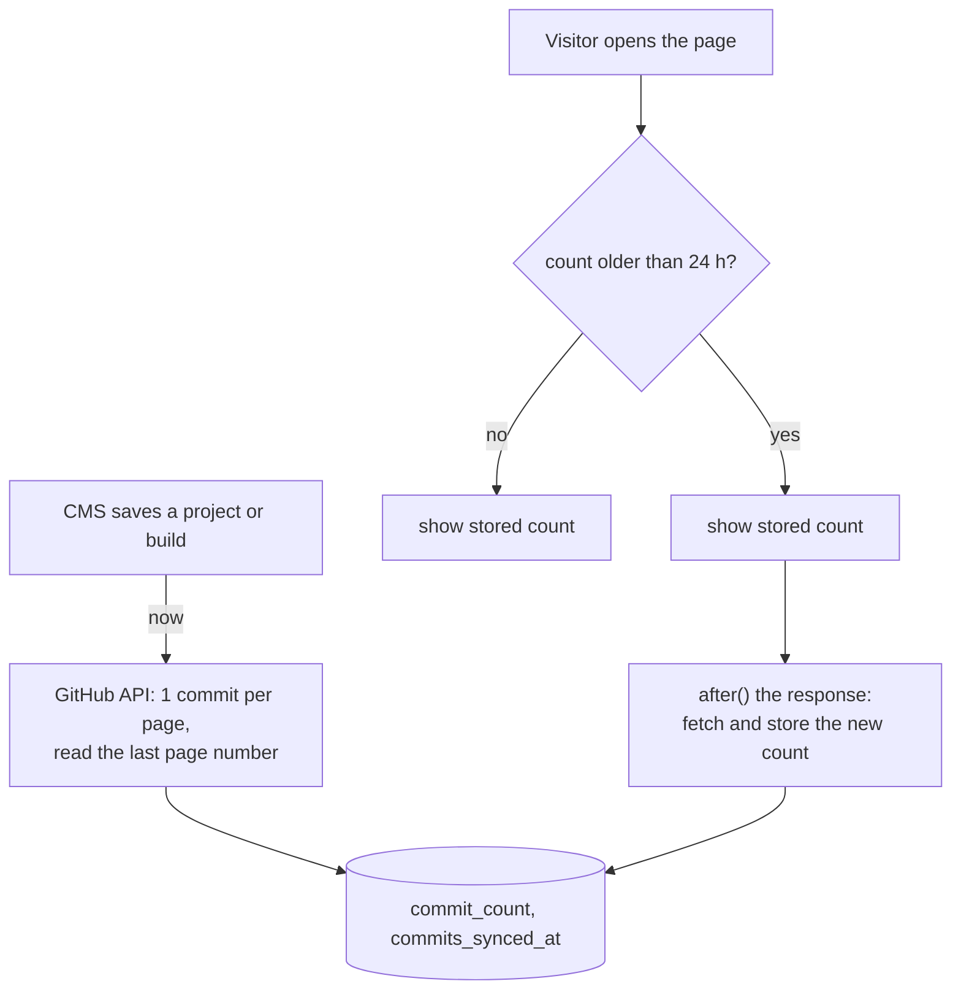

# Content workflows

How each kind of content gets onto the site, from the person who creates it
to the page that shows it.

## Content the maintainers own

Board, events, journey, projects, members and teams are written entirely by
maintainers in the CMS. The pattern is the same for all of them:

There is no cache to clear and no rebuild. Every public page reads D1 on
each request, so a save is live on the next page load.

| Content  | Shows up on                                          | Notes                                                    |
| -------- | ---------------------------------------------------- | -------------------------------------------------------- |
| Board    | Homepage "Board" section                             | Photo in Cloudinary `board/`; ring colour is a key       |
| Events   | Homepage "Events" section, event dialog              | Ordered photos, first is the cover, up to 12             |
| Journey  | Homepage timeline                                    | Icon is a key from `features/journey/icons.ts`           |
| Projects | Homepage "Projects", `/projects`, `/projects/[slug]` | Team credits come from Members; commit count from GitHub |
| Members  | `/members`, profile dialogs, project pages           | Avatar, not a photo; grouped by team                     |
| Teams    | `/members` groups                                    | Deleting a team keeps its members                        |

Project bodies use a tiny text format rather than Markdown: blank lines
separate paragraphs, `## ` starts a heading, lines starting `- ` make a list
(`features/projects/prose.tsx`). Everything renders as text, never HTML.

## Join applications

The form collects name, email, phone, branch, year, GitHub username
(optional) and why they want to join. The same section offers the WhatsApp
community group's QR code, which is open to everyone and needs no
application.

## Proposals (ideas for the club to build)

Any student can suggest a tool the club could build, at `/proposals/new`. The
form asks one question per screen and needs no account.

- A maintainer can set any status at any time; the diagram shows the usual
  path.
- `pending` and `declined` are private. `accepted`, `building` and `built`
  appear on `/proposals` and in the homepage "Ideas" section.
- The public page shows `public_name` (their first name by default,
  editable in the CMS), never the full name, phone or registration number.
- Maintainers can leave an `admin_note`; it is for maintainers and is not
  shown on the tracking page.

## Builds (students' own projects)

Students submit something they built at `/builds/submit`, with up to 6
screenshots.

When accepting, the maintainer:

- puts it in a **month** (required), which groups it on `/builds`;
- may mark it as one of a **week's** builds (`week_of`, that week's Monday);
- checks the **slug** (its address, `/builds/<slug>`; `submit` and `track`
  are reserved);
- can edit the page text, credits (lead and teammates) and developer notes.

Saving fetches the repository's commit count straight away.

Screenshots are uploaded by the student's browser straight to Cloudinary,
into the `build-submissions` folder only. Declining a build does not delete
its images from Cloudinary (tracked in `TODO.md`).

## Track links

Students have no accounts, so each proposal and build gets a private status
link, shown once on the thank-you screen:

- Only the hash is stored, so neither the CMS nor a backup can show a
  working link. If a student loses theirs, it cannot be recovered; a
  maintainer can tell them the status directly.
- 192 random bits cannot be guessed, so the page needs no password.
- The page shows the title and status only, nothing the student did not
  already know.

Code: `lib/tracking.ts`, `features/tracking/`, `app/*/track/[token]/`.

## Commit counts

Projects and builds with a GitHub repository show its commit count.

If GitHub is unreachable the old number stays and the time is still
updated, so a broken repository is retried daily, not on every view. A null
count hides the counter rather than showing zero.
