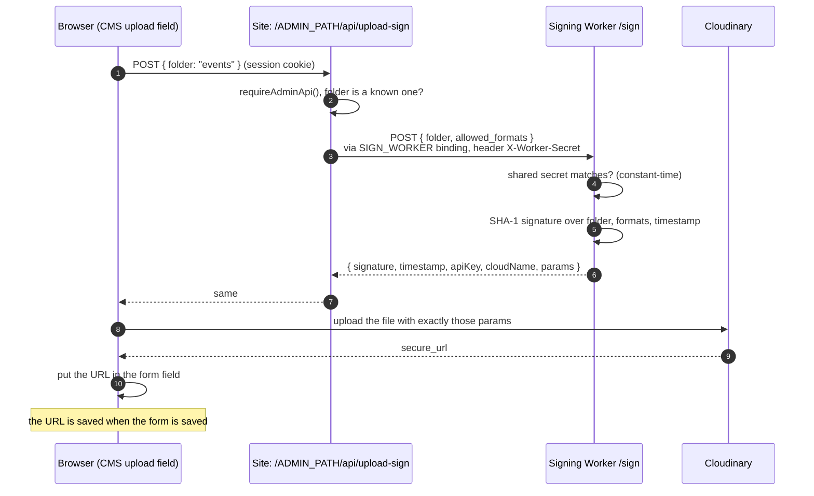

# Media and uploads

## Where images live

**Every photo and screenshot lives in Cloudinary.** The database stores only
the Cloudinary URL. Cloudflare hosts the site and the database, not media.

`public/` in the repository holds site assets only: the 3D Octocat model,
the logo, the WhatsApp QR code and the background doodle tile. Never commit
photos of people or events there.

| Image                           | Cloudinary folder    | Uploaded by          |
| ------------------------------- | -------------------- | -------------------- |
| Board member photos             | `board/`             | Maintainer, CMS      |
| Member avatars                  | `members/`           | Maintainer, CMS      |
| Project covers and previews     | `projects/`          | Maintainer, CMS      |
| Event photos                    | `events/`            | Maintainer, CMS      |
| Build images edited in CMS      | `builds/`            | Maintainer, CMS      |
| Build screenshots from students | `build-submissions/` | Student, public form |

The folder list is `lib/cloudinary/folders.ts`. Validation
(`lib/validation/image.ts`) rejects board, member and event image URLs that
are not Cloudinary URLs.

## Why uploads go through a second Worker

A Cloudinary upload must be **signed** with the Cloudinary API secret.
Whoever holds that secret can upload, overwrite or delete anything in the
account. So the secret is kept in a tiny separate Worker,
`workers/cloudinary-sign`, and the main site never has it.

- The browser uploads the file **directly** to Cloudinary; the image never
  passes through the site's Worker.
- The signature covers the folder and allowed formats, so the browser cannot
  change them without Cloudinary rejecting the upload.
- The site authenticates to the signing Worker with `WORKER_SHARED_SECRET`,
  not the session cookie, because the cookie belongs to the site's domain
  and is never sent to the Worker's.

The **public** build form uses the same Worker through
`POST /api/builds/upload-sign`, which needs no login. Its signature is
always for the `build-submissions` folder and `jpg, jpeg, png, webp` only,
and `lib/validation/build.ts` accepts only image URLs inside that folder.

## Limits in the CMS upload field

`features/admin/image-upload-field.tsx` checks before uploading:

- JPG, PNG or WebP only;
- 8 MB at most;
- several files at once where a field takes a gallery (events).

Errors from Cloudinary are shown as they come back, rather than a generic
"upload failed".

## Showing images

Images are drawn with `next/image`, which resizes them through Cloudflare
Images (the `IMAGES` binding). `next/image` only loads remote images from
hosts listed in `next.config.js` `images.remotePatterns`. Currently:

- `res.cloudinary.com` (all real content);
- `picsum.photos` (placeholder images for a local test database only).

**A new image host must be added there**, or every image from it fails with
a 400.

## Deleting images

Removing an image in the CMS removes its URL from the database. The file
stays in Cloudinary. Clean up occasionally in the Cloudinary Media Library,
especially `build-submissions/` for declined builds.

## Photos of people

Board members appear with photos. Club members asked not to show their
faces, so member images are avatars they generate themselves from a shared
prompt: see [Member avatar prompt](./member-avatar-prompt.md).
