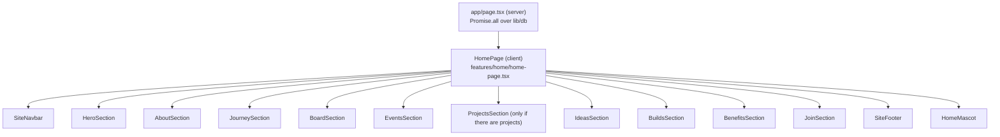

# Frontend

## The homepage

`app/page.tsx` is a server component that loads everything the homepage
needs in one `Promise.all` and hands it to the client component
`features/home/home-page.tsx`. Each section is its own file in
`features/home/sections/`.

To add a section: create `features/home/sections/<id>.tsx`, render it in
`home-page.tsx`, and add it to `features/site/nav.ts` if it belongs in the
navbar. Keep `app/page.tsx` to fetching and composing.

Links to homepage sections from any other page are `/#<id>`. A bare `#<id>`
does nothing off the homepage.

## Inner pages

`/members`, `/projects`, `/proposals`, `/builds` and their sub-pages wrap
themselves in `PageChrome` (`features/site/page-chrome.tsx`), which provides
the same navbar, footer and mascot as the homepage. Their headers include a
`MascotSlot` where the mascot rests.

## Visual language

- **Dark only.** GitHub's dark palette. There is no light mode.
- **One accent colour,** GitHub green `#3fb950`. Statuses and badges are
  green for "usable now" and neutral for everything else, not a rainbow.
- **Fonts:** Geist and Geist Mono, loaded with `next/font` in
  `app/layout.tsx`.
- **Background:** a faint "doodle field" of git and code marks
  (`components/ui/texture.tsx`, tile built by `npm run build:doodles`).

### The palette is defined twice

| Where                                                                     | Used by                                |
| ------------------------------------------------------------------------- | -------------------------------------- |
| `gh.*` colours in `tailwind.config.js` (`bg-gh-surface`, `text-gh-muted`) | The public site                        |
| shadcn HSL variables in `app/globals.css`                                 | `components/ui` primitives and the CMS |

Changing a colour usually means changing both.

| Token         | Value     | Use                      |
| ------------- | --------- | ------------------------ |
| `gh-deep`     | `#010409` | Deepest surfaces, footer |
| `gh-bg`       | `#0d1117` | Page background          |
| `gh-surface`  | `#161b22` | Cards                    |
| `gh-elevated` | `#21262d` | Raised elements, inputs  |
| `gh-border`   | `#30363d` | Borders                  |
| `gh-text`     | `#e6edf3` | Body text                |
| `gh-muted`    | `#8b949e` | Secondary text           |
| `gh-accent`   | `#3fb950` | The accent               |

## The Octocat mascot

A 3D Octocat (`public/models/github-octocat.glb`, CC BY 4.0, credited in the
README) rendered with Three.js through react-three-fiber. It is a valued
part of the site; keep it through any redesign.

- `features/mascot/gh-mascot-3d.tsx` draws the model. Its eyes follow the
  cursor; clicking it spins it.
- `features/mascot/home-mascot.tsx` places it: large in the hero, then, as
  you scroll, it shrinks and docks beside each section, alternating sides.
- On inner pages `page-mascot.tsx` does the same, finding sections marked
  `data-mascot-dock` and a `MascotSlot` in the header.
- Docking only happens with a mouse on screens 1024px and wider. On phones
  and tablets it stays in the hero and scrolls away with it. Below 768px it
  is hidden.
- Dialogs can ask it to "perch" on their top edge (`perch.ts`).
- The `/admin` decoy uses the same model, watching the visitor.

## Motion

| Tool                 | Used for                                                                        |
| -------------------- | ------------------------------------------------------------------------------- |
| framer-motion        | Entrances, dialogs, hover effects                                               |
| Lenis                | Smooth scrolling (`features/site/smooth-scroll.tsx`), one instance for the page |
| View Transitions API | Listing card to project page morph (`features/site/transition.tsx`)             |

Rules:

- Import `framer-motion`, never `motion/react`. They are two copies of the
  same library, and the site-wide `MotionConfig reducedMotion="user"` only
  reaches one.
- For "does the visitor want reduced motion?" use
  `lib/use-reduced-motion.ts`, not framer's hook. Framer's reads the setting
  during the first render in the browser, which differs from the server's
  render and causes a hydration error.
- Lenis moves the page with transforms, so `overflow: hidden` on `body`
  does not stop it. Dialogs call `lenis.stop()` (see `dialog-shell.tsx`).

## Forms

The proposal and build forms are one question per screen
(`features/forms/stepper-form.tsx`): Enter moves on, letter keys pick
choices, and later questions can use earlier answers. The join form on the
homepage is a single short form.

Inputs are at least 16px on phones; iOS Safari zooms into anything smaller.

## Responsiveness

Breakpoints are Tailwind's (`sm` 640, `md` 768, `lg` 1024, `xl` 1280). Every
public page was checked at 360, 390, 820 and 1180 pixels wide. Things that
went wrong before and are worth re-checking after layout changes:

- The mobile menu toggle must stay above the navbar's glass backdrop
  (`relative z-20` on the header row).
- `overflow-x-hidden` on an ancestor breaks `position: sticky` below it; use
  `overflow-x-clip` instead.
- Long unbroken text (repository names, URLs) in a grid needs a
  `minmax(0, 1fr)` column or it widens the page.

## Copy

Visible text is written plainly and must be true. In particular: no em
dashes, no claims the club does not live up to, and keep the community group
(open to all) distinct from the club (recruits in rounds). Some copy lives in
the database (event titles and descriptions, journey entries), so a copy
review has to look at the CMS as well as the code.
