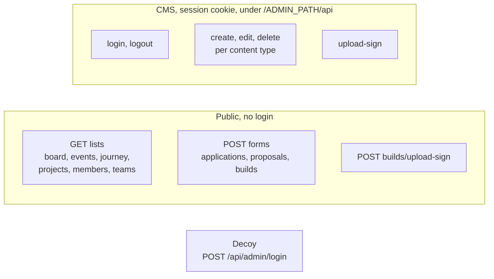

# API reference

Every HTTP endpoint the site has, what it expects and what it answers. All
of them live in `app/api/`, run inside the one Worker, and speak JSON unless
noted. There is no separate backend.

## Conventions

- **Validation errors** come back as `400` with
  `{ "errors": { "<field>": "<message>" } }` (public forms add
  `"ok": false`). The forms show each message next to its field.
- **Bot trap:** the public forms send a hidden `company` field that people
  never see. If it is filled, the endpoint answers `201 { "ok": true }` and
  stores nothing.
- **IDs** in admin URLs must be positive whole numbers, otherwise `400`.
- **Duplicates** (an email that already applied, a taken slug or team name)
  answer `409` with a field error.
- **Admin endpoints** answer `401 { "error": "Unauthorized" }` without a
  valid session cookie.

## Public endpoints

### Reading content

All `GET`, no parameters, `force-dynamic` (always fresh from the database),
and they return only public columns.

| Endpoint                 | Returns                       |
| ------------------------ | ----------------------------- |
| `GET /api/board-members` | Board members, in CMS order   |
| `GET /api/events`        | Events with their photo lists |
| `GET /api/journey`       | Timeline entries              |
| `GET /api/projects`      | Projects                      |
| `GET /api/members`       | Members (no private fields)   |
| `GET /api/teams`         | Teams                         |

The site's own pages do not call these; they read the database directly in
server components. The endpoints exist for anything else that wants the data.
Proposals and builds have no public list endpoint; their pages read the
database the same way.

### `POST /api/applications`: the join form

Body: `fullName`, `email`, `phone`, `branch`, `year`, `githubUsername`
(optional), `whyJoin`, plus the hidden `company`.

| Answer             | When                           |
| ------------------ | ------------------------------ |
| `201 { ok: true }` | Saved                          |
| `400`              | Validation failed              |
| `409`              | This email has already applied |

### `POST /api/proposals`: suggest an idea

Body:

| Field      | Rule                                                     |
| ---------- | -------------------------------------------------------- |
| `title`    | Required, up to 80 characters                            |
| `idea`     | Required, up to 1000 characters                          |
| `audience` | A key: `students`, `faculty`, `clubs`, `campus`, `other` |
| `format`   | A key: `website`, `app`, `chat`, `unsure`                |
| `help`     | A key: `build`, `test`, `none`                           |
| `name`     | Required, up to 80 characters (private)                  |
| `year`     | `"1"` to `"5"` (year of study)                           |
| `branch`   | Required, up to 60 characters                            |
| `regNo`    | GITAM registration number (private)                      |
| `phone`    | Indian mobile number (private)                           |

Answer: `201 { ok: true, track: "<32-character token>" }`. The browser shows
`/proposals/track/<token>` once. Only the SHA-256 of the token is stored.
New proposals are `pending` and private.

### `POST /api/builds/upload-sign`: sign a screenshot upload

No body. Asks the signing Worker for a Cloudinary signature fixed to the
`build-submissions` folder and `jpg,jpeg,png,webp`. Answers the signature,
or `503` if uploads are not configured (or the signing Worker is an old
version that ignores those limits), or `502` if it cannot be reached.

### `POST /api/builds`: submit a build

Body: `title` (up to 60), `tagline` (up to 100), `description` (up to 1500),
`builtWith` (up to 200), `liveUrl`, `repoUrl`, `images` (up to 6 Cloudinary
URLs, all inside `build-submissions/`), `teammates` (up to 200), `devNotes`,
plus the same student fields as proposals (`name`, `year`, `branch`,
`regNo`, `phone`).

Answer: `201 { ok: true, track }`, like proposals. The build gets a slug from
its title, starts `pending` and stays private until accepted.

## CMS endpoints

Called by the CMS screens. The public URL is `/<ADMIN_PATH>/api/...`;
`proxy.ts` maps it to `app/api/admin/...`. Every handler first calls
`requireAdminApi()`.

| Content       | Create (`POST`)        | Edit (`PATCH`) and delete (`DELETE`) |
| ------------- | ---------------------- | ------------------------------------ |
| Board members | `/api/board-members`   | `/api/board-members/{id}`            |
| Events        | `/api/events`          | `/api/events/{id}`                   |
| Journey       | `/api/journey`         | `/api/journey/{id}`                  |
| Projects      | `/api/projects`        | `/api/projects/{id}`                 |
| Members       | `/api/members`         | `/api/members/{id}`                  |
| Teams         | `/api/teams`           | `/api/teams/{id}`                    |
| Proposals     | (students create them) | `/api/proposals/{id}`                |
| Builds        | (students create them) | `/api/builds/{id}`                   |

(All paths above are relative to `/<ADMIN_PATH>`.)

- `POST` answers `201` with the new row; `PATCH` answers `200` with the
  updated row, or `404` if the id does not exist; `DELETE` answers
  `200 { ok: true }`.
- The body of each is the fields of its CMS form, checked by
  `lib/validation/<type>.ts`.
- Saving a project or a build also fetches its GitHub commit count.
- **Reviewing a proposal** (`PATCH`): `title`, `idea`, `audience`, `format`,
  `publicName` (up to 40), `status` (`pending`, `accepted`, `building`,
  `built`, `declined`), `adminNote` (up to 1000). `reviewed_at` is stamped
  the first time it leaves `pending`.
- **Reviewing a build** (`PATCH`): the page fields, `slug` (lowercase,
  numbers and single hyphens, up to 80, not `submit` or `track`), `status`
  (`pending`, `accepted`, `declined`), `month` (`YYYY-MM`, required when
  accepted), `weekOf` (a Monday, `YYYY-MM-DD`, optional), `credits` (up to
  12 people, each `{ name, role: "lead" | "member", contribution }`),
  `images`, `devNotes`, `sortOrder`.
- There is no endpoint for applications; the CMS reads them directly and
  they cannot be edited or deleted from the CMS.

### Session and uploads

| Endpoint                             | Does                                                                                                                                                                                                                                                |
| ------------------------------------ | --------------------------------------------------------------------------------------------------------------------------------------------------------------------------------------------------------------------------------------------------- |
| `POST /<ADMIN_PATH>/api/login`       | Form post with `password`. Sets the session cookie and redirects to the dashboard, or back to login with `error=1&left=N` or `error=locked`                                                                                                         |
| `POST /<ADMIN_PATH>/api/logout`      | Clears the cookie, redirects to login                                                                                                                                                                                                               |
| `POST /<ADMIN_PATH>/api/upload-sign` | Body `{ folder }` (`board`, `members`, `projects`, `events`, `builds`). Returns a Cloudinary signature for that folder. `400` for another folder, `503` if not configured, `502` if the signer is unreachable or returned an unrestricted signature |

## The decoy

`POST /api/admin/login` (what a prober guesses) is served by
`app/api/honeypot/route.ts`. It logs the `username` field, never reads a
password, waits about a second and always answers
`401 { "error": "Invalid credentials" }`. Any other `/api/admin/...` URL is
a 404.

## The signing Worker

`workers/cloudinary-sign`, deployed separately. One endpoint:

`POST /sign`, header `X-Worker-Secret: <WORKER_SHARED_SECRET>`, optional
body `{ folder, allowed_formats }`. Answers
`{ signature, timestamp, apiKey, cloudName, params }`, where `params` repeats
exactly what was signed. Only the site calls it, server to server: through
the `SIGN_WORKER` service binding in production (same-account `workers.dev`
fetches are blocked), through `UPLOAD_SIGN_URL` in local development.
