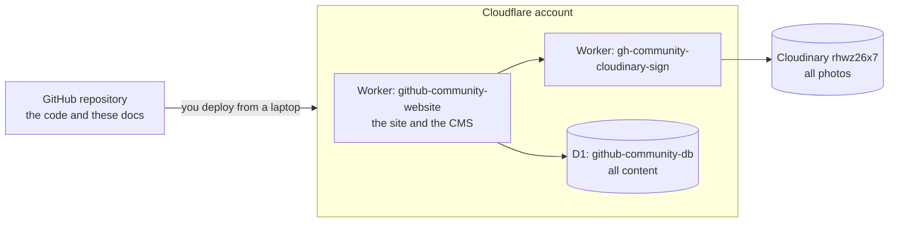

# Guide for a new board

You have just taken over the club, and with it this website. This page takes
you from "we have nothing" to "we can edit content, change code and deploy",
in order. Every step links to the page with the details.

## What you are inheriting



| Thing                    | Where                                                            | Who owns the login                       |
| ------------------------ | ---------------------------------------------------------------- | ---------------------------------------- |
| Code and docs            | GitHub, `Git-HubCommunityGitamHyd/Github-Community-Club-Website` | The club's GitHub organisation           |
| Site, CMS and database   | Cloudflare account (workers.dev subdomain `gh-community-gitam`)  | The club's shared Google account         |
| Photos                   | Cloudinary, cloud name `rhwz26x7`                                | The club's Cloudinary account            |
| CMS address and password | Worker secrets `ADMIN_PATH`, `ADMIN_PASSWORD`                    | Passed privately from the outgoing board |

The live site is at
`https://github-community-website.gh-community-gitam.workers.dev` (or a
custom domain if one has been added since; check the Worker's Domains and
Routes in Cloudflare).

## Step 1: get access (with the outgoing board)

- [ ] GitHub: write access to the repository for whoever will change code.
- [ ] Cloudflare: log in with the club account, or be added as a member
      (Manage account, Members) with rights to Workers and D1.
- [ ] Cloudinary: log in with the club account, or be added under
      Settings, Users.
- [ ] The CMS address and password, told to you privately. Then **change
      both** (step 5) so the outgoing board no longer has them.
- [ ] Store all of it in one password manager the board shares.

If the outgoing board is unreachable and nobody has the Cloudflare login,
recover it through the club's Google account (password reset). Without the
Cloudflare account nobody can deploy or reach the database.

## Step 2: editing content (no code needed)

Most of running the site is this. Open the CMS address, log in, and use the
nav. Anything saved is live on the next page load.

Recommended order when filling it from empty, because some screens pick from
others:

1. **Teams**, then **Members** (members pick their team), then **Projects**
   (projects credit members).
2. **Board**, **Events**, **Journey**, in any order.
3. Check **Proposals** and **Builds** regularly: students submit these, and
   the nav shows how many are waiting.
4. **Applications** lists everyone who applied to join, for your
   recruitment round.

Details: [CMS and security](./06-cms-and-security.md) and
[Content workflows](./07-content-workflows.md). Member pictures are avatars,
not photos: send new members the [avatar prompt](./member-avatar-prompt.md).

## Step 3: set up a laptop for code changes

Only needed if you will change code or deploy.

1. Install Node.js 20+ and git, clone the repository, `npm install`.
2. `npx wrangler login` with the club's Cloudflare account. Then check with
   `npx wrangler whoami`: every remote command acts on whatever account this
   shows.
3. `cp .env.example .env`, fill it in (development values, never the
   production ones), `npm run db:migrate:local`, `npm run dev`.

Full walkthrough: [Local development](./03-local-development.md). Read its
conventions section before changing code, and `CLAUDE.md` at the repo root
for the traps previous maintainers fell into.

## Step 4: ship a change

```bash
npm test && npx tsc --noEmit && npm run lint && npm run build
npm run deploy
```

- If the change added a file under `db/migrations/`, run it on production
  first: `npm run db:patch:remote -- db/migrations/<file>.sql`.
- `npm run deploy` builds without your local `.env` on purpose, so your
  laptop's secrets never end up in the production Worker.
- Afterwards open the live site and the CMS and check what you changed.
- If something broke, roll back in the Cloudflare dashboard (the Worker,
  Deployments, previous version).

Full detail, including first-time setup from nothing:
[Deployment](./04-deployment.md).

## Step 5: change the secrets you inherited

From the repository folder, logged into the club's Cloudflare account:

```bash
npx wrangler secret put ADMIN_PASSWORD
```

```bash
openssl rand -hex 32 | tr -d '\n' | npx wrangler secret put SESSION_SECRET
```

```bash
P=$(openssl rand -hex 12) && printf %s "$P" | npx wrangler secret put ADMIN_PATH && echo "New CMS address: /$P"
```

Changing `SESSION_SECRET` logs everyone out; the new `ADMIN_PATH` makes the
old address a 404. Share the new address and password privately. More in
the [Operations runbook](./10-operations-runbook.md).

## Step 6: know where to look when something is wrong

| Question                                     | Page                                                                         |
| -------------------------------------------- | ---------------------------------------------------------------------------- |
| Something on the site is broken              | [Operations runbook](./10-operations-runbook.md), "Common problems"          |
| How does a page, form or API work?           | [Architecture](./02-architecture.md), [API reference](./11-api-reference.md) |
| What is in the database, how do I change it? | [Database](./05-database.md)                                                 |
| Uploads fail                                 | [Media and uploads](./08-media-and-uploads.md)                               |
| Who tried to break in?                       | The CMS **Security** page                                                    |
| What is known to be missing?                 | [Known gaps](./10-operations-runbook.md#known-gaps)                          |

## Step 7: before you hand over

When your term ends, do this page again with the next board, in the other
seat: give them access, walk them through the CMS, have them change the
secrets, and remove yourselves from GitHub, Cloudflare and Cloudinary. Update
anything in these docs that is no longer true.
